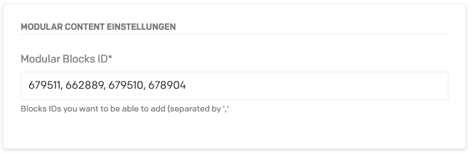

# Modular Content DatoCMS plugin

With this Plugin you can use your Blocks Models in other Blocks. So it´s a Plugin for nested Content. The Content you can use can be set in Field Settings if you´re my the Field Editor.

## Screenshots



Here you can add the Block IDs you want to be able to use.

## NPM Package

Install the Plugin:

```
npm i datocms-plugin-modular-content
```

Install all the project dependencies with:

```
yarn install
```

Add this plugin in development mode to one of your DatoCMS project with:

```
yarn addToProject
```

Start the local development server with:

```
yarn start
```

The plugin will be served from [http://localhost:5000/](http://localhost:5000/). Insert this URL as the plugin [Entry point URL](https://www.datocms.com/docs/plugins/creating-a-new-plugin/).

## Donate

I know that much of us have wished us this function, so if you´re happy with it, you can donate me via Paypal! Thank you!

## License
This package is available under `MIT` License.